# QPSK-Demodulation-Signal-Recovery-Analysis
This repository documents an experiment on the full demodulation of a Quadrature Phase Shift Keying (QPSK) signal. The primary goal is to demonstrate how a complex modulated signal is split into In-phase (I) and Quadrature (Q) components to recover the original serial data stream.

## TABLE OF CONTENTS
* [Part A: Verifying Serial-to-Parallel Operation](#part-a-verifying-serial-to-parallel-operation)
* [Part B: Generating the QPSK Signal](#part-b-generating-the-qpsk-signal)
* [Part C: Modeling Channel Conditions](#part-c-modeling-channel-conditions)
* [Part D: Full Demodulation of the QPSK Signal](#part-d-full-demodulation-of-the-qpsk-signal)
* [Part E: Observation of Noise on Recovered Signals](#part-e-observation-of-noise-on-recovered-digital-data)
* [Results & Data Analysis](#results--data-analysis)

## Overview
Quadrature Phase Shift Keying (QPSK) is a bandwidth-efficient modulation scheme that transmits two bits of digital information per symbol by varying the phase of a carrier wave. This experiment focuses on the coherent demodulation process, where a complex, multi-phase signal is decomposed into its constituent In-phase ($I$) and Quadrature ($Q$) components to reconstruct the original high-speed serial data.

## Part A: Verifying Serial-to-Parallel Operation
The initial stage of a QPSK transmitter requires the transformation of a high-speed serial data stream into two parallel streams ($I$ and $Q$). This "bit-splitting" is essential because QPSK encodes two bits per symbol period.
- Methodology: A $2\text{ kHz}$ Pseudo-Random Binary Sequence (PRBS) from the Sequence Generator was fed into the Serial-to-Parallel (S/P) Converter.
- Observations: Using the oscilloscope, it was verified that the bit rate of the $I$ and $Q$ channels was exactly half that of the original sequence ($1\text{ kbps}$ each).
- Technical Insight: The S/P converter uses the master clock to latch the first bit to the In-phase channel and the second bit to the Quadrature channel, effectively doubling the "symbol time" and allowing for higher spectral efficiency in the modulation stages.

#### **1.1 Verifying Serial-to-Parallel Operation Experimental Diagrams**

View Part 1.1 Diagrams

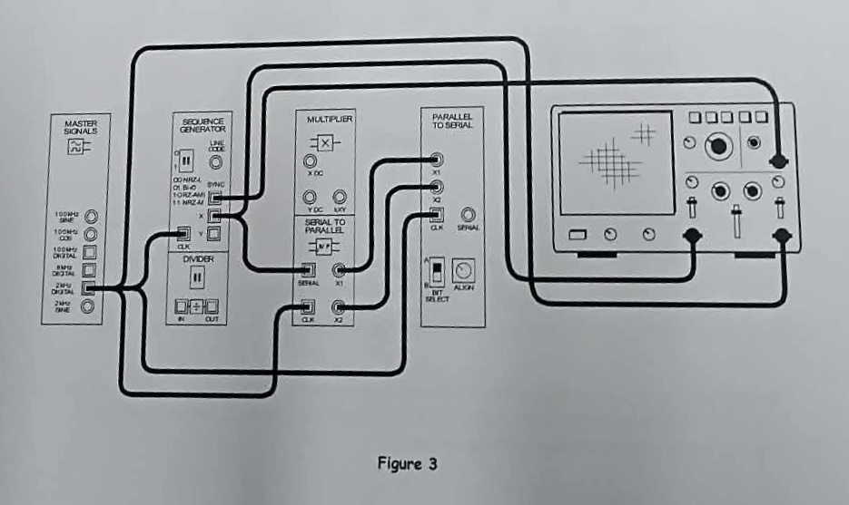

*Figure 1.1.1: Verifying Serial-to-Parallel Operation Setup.*

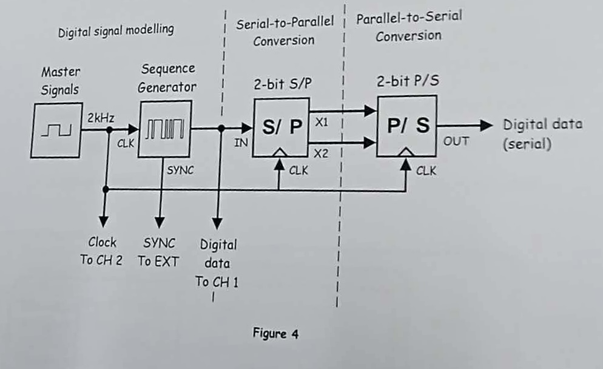

*Figure 1.1.2: Verifying Serial-to-Parallel Operation Diagram.*

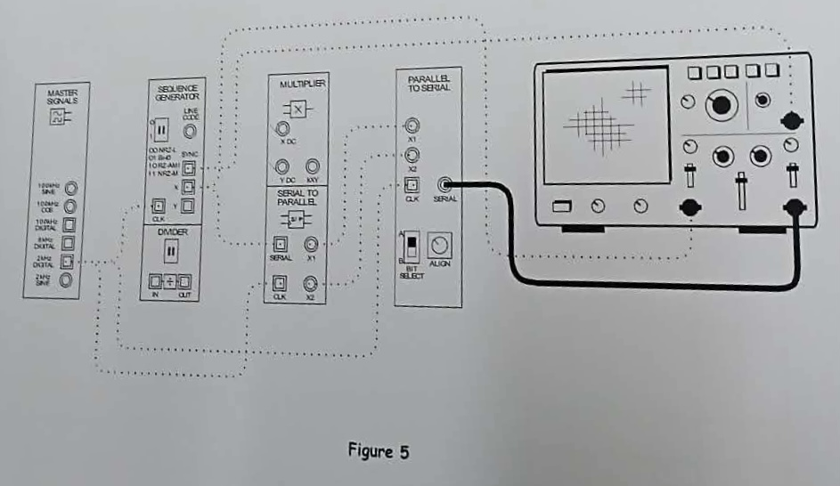

*Figure 1.1.3: Verifying Serial-to-Parallel Operation Setup.*

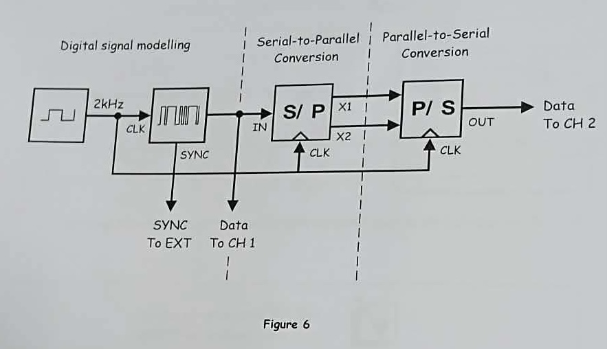

*Figure 1.1.4: Verifying Serial-to-Parallel Operation Diagram.*

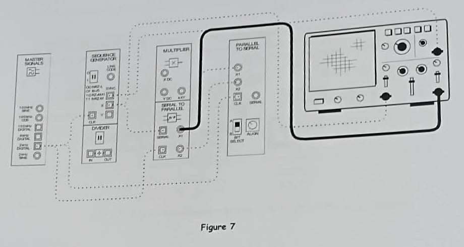

*Figure 1.1.5: Verifying Serial-to-Parallel Operation Setup.*

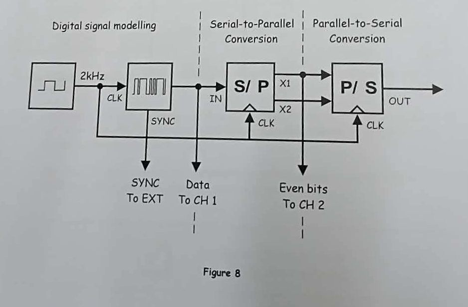

*Figure 1.1.6: Verifying Serial-to-Parallel Operation Diagram.*

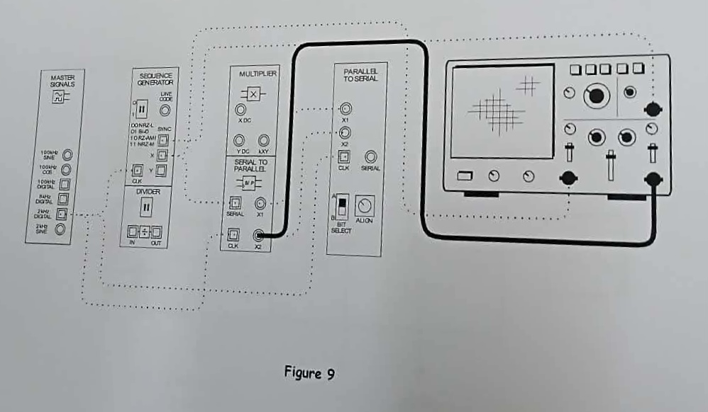

*Figure 1.1.7: Verifying Serial-to-Parallel Operation Setup.*

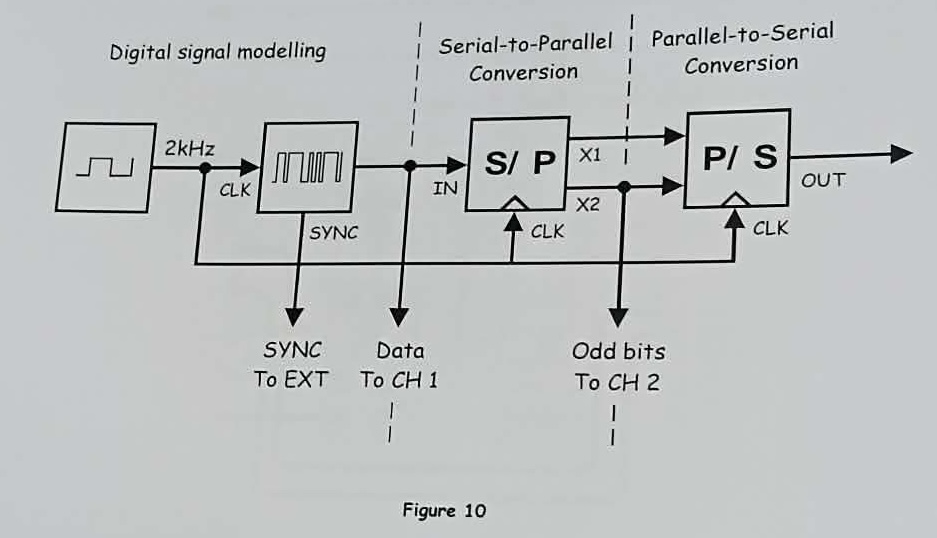

*Figure 1.1.8: Verifying Serial-to-Parallel Operation Diagram.*

#### **1.2 Verifying Serial-to-Parallel Operation Experimental Results**

View Part 1.2 Documentation

*Figure 1.2.1: Verifying Serial-to-Parallel Operation Signal*

## Part B: Generating the QPSK Signal
QPSK modulation works by combining two BPSK (Binary Phase Shift Keying) signals that are orthogonal to each other.
- Orthogonal Carriers: A $100\text{ kHz}$ sine wave was split. One path was sent through a Phase Shifter to create a $90^\circ$ offset ($\sin$), while the other remained at $0^\circ$ ($\cos$).
- Modulation Process:
    - The $I$ stream was multiplied with the $0^\circ$ carrier.
    - The $Q$ stream was multiplied with the $90^\circ$ carrier.
- Summation: These two signals were combined using an Adder module. The resulting output is a constant-amplitude carrier that shifts between four distinct phases: $45^\circ$, $135^\circ$, $225^\circ$, and $315^\circ$.

#### **2.1 Generating the QPSK Signal Experimental Diagrams**

View Part 2.1 Diagrams

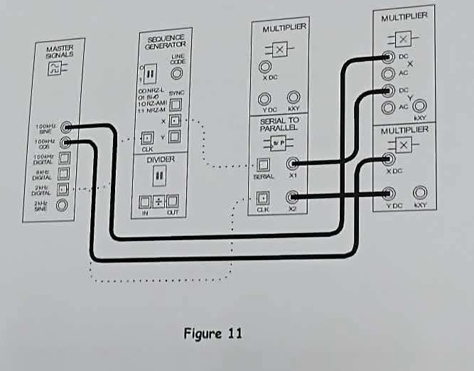

*Figure 2.1.1: Generating the QPSK Signal Setup.*

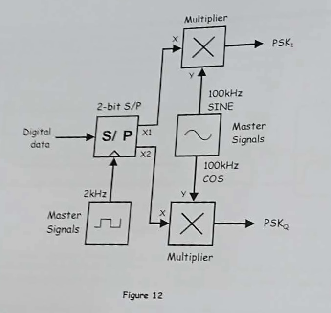

*Figure 2.1.2: Generating the QPSK Signal Diagram.*

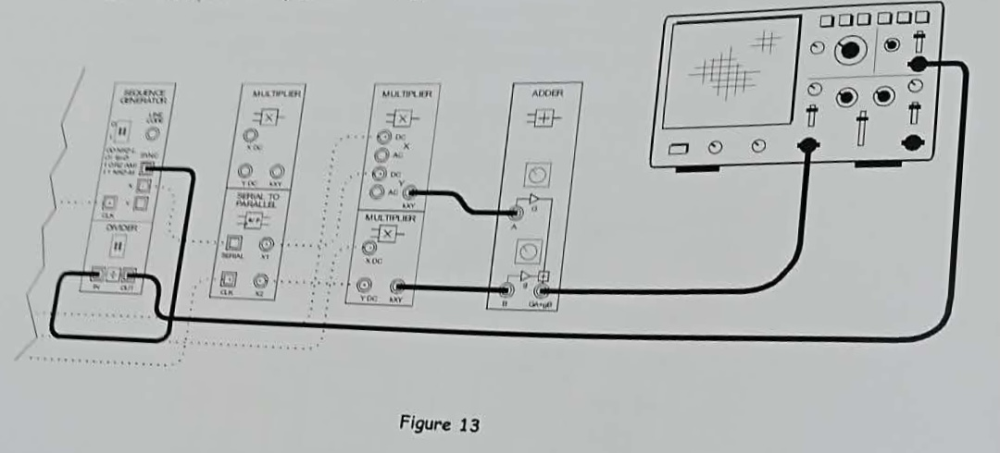

*Figure 2.1.3: Generating the QPSK Signal Setup.*

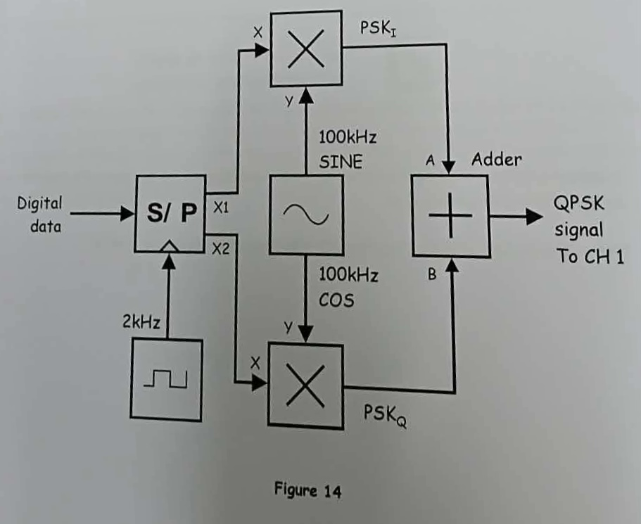

*Figure 2.1.4: Generating the QPSK Signal Diagram.*

#### **2.2 Generating the QPSK Signal Experimental Results**

View Part 2.2 Documentation

*Figure 2.2.1: Generating the QPSK Signal*

## Part C: Modeling Channel Conditions
Communication signals rarely arrive at the receiver in perfect condition. This part of the experiment simulates the physical medium (air, fiber, or cable).
- Implementation: The modulated signal was passed through a Channel Module which allowed for the adjustment of path gain and phase delay.
- Analysis: We observed how phase rotation in the channel shifts the constellation away from its ideal axes. This stage highlights the necessity of the receiver's local oscillator being able to "track" the phase of the incoming signal, as any discrepancy here leads to direct data corruption in the demodulation stage.

#### **3.1 Modeling Channel Conditions Experimental Diagrams**

View Part 3.1 Diagrams

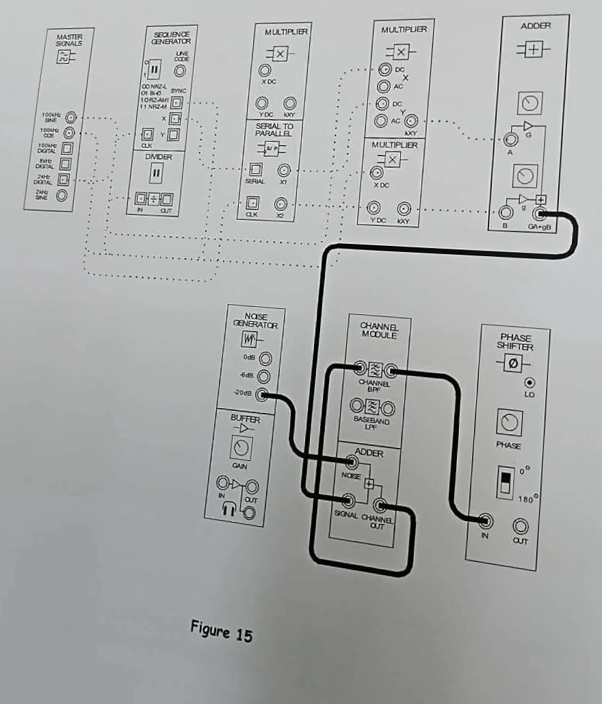

*Figure 3.1.1: Modeling Channel Conditions Setup.*

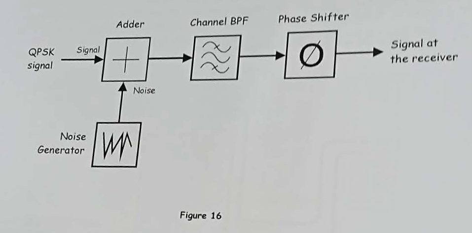

*Figure 3.1.1: Modeling Channel Conditions Diagram.*

#### **3.2 Modeling Channel Conditions Experimental Results**

View Part 3.2 Documentation

*Figure 3.2.1: Modeling Channel Conditions Signal*

## Part D: Full Demodulation of the QPSK Signal
Demodulation is the inverse of the transmitter process, requiring Coherent Detection to extract the data.
- Product Detection: The received signal was split into two branches and fed into Multipliers. These were mixed with a local $100\text{ kHz}$ reference carrier.
- Frequency Rejection: The multiplication produces a baseband component and a high-frequency component ($2f_c$). Tuneable Low-Pass Filters (LPF) were used to isolate the baseband $I$ and $Q$ bitstreams.
- Reconstruction: Finally, the parallel bits were fed into a Parallel-to-Serial (P/S) Converter. By interleaving the $I$ and $Q$ bits back into a single stream, the original $2\text{ kHz}$ message was successfully recovered.

#### **4.1 Full Demodulation of the QPSK Signal Experimental Diagrams**

View Part 4.1 Diagrams

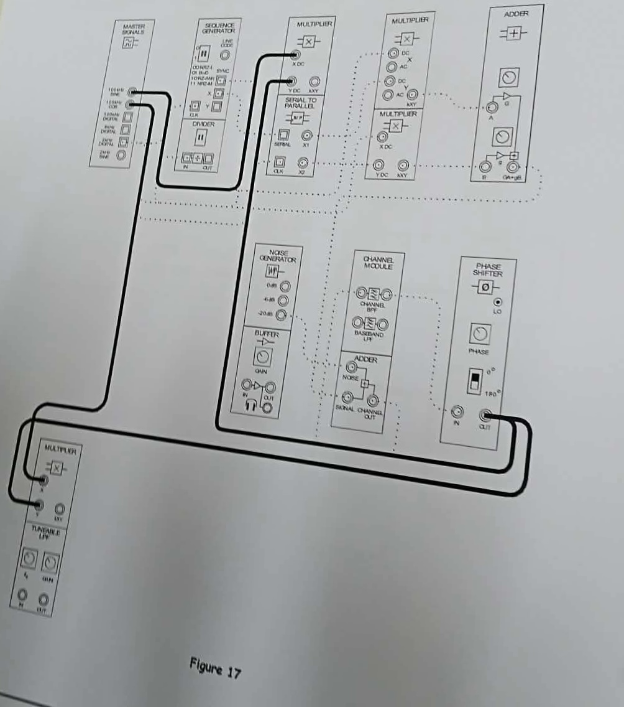

*Figure 4.1.1: Full Demodulation of the QPSK Signal Setup.*

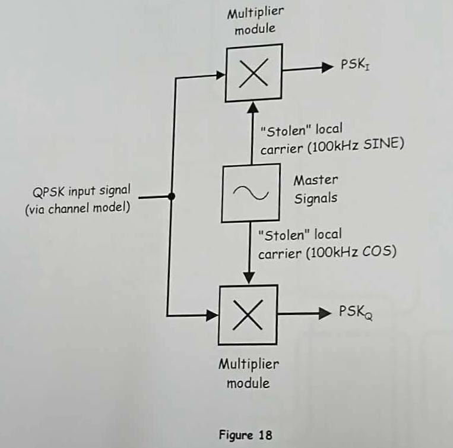

*Figure 4.1.1: Full Demodulation of the QPSK Signal Diagram.*

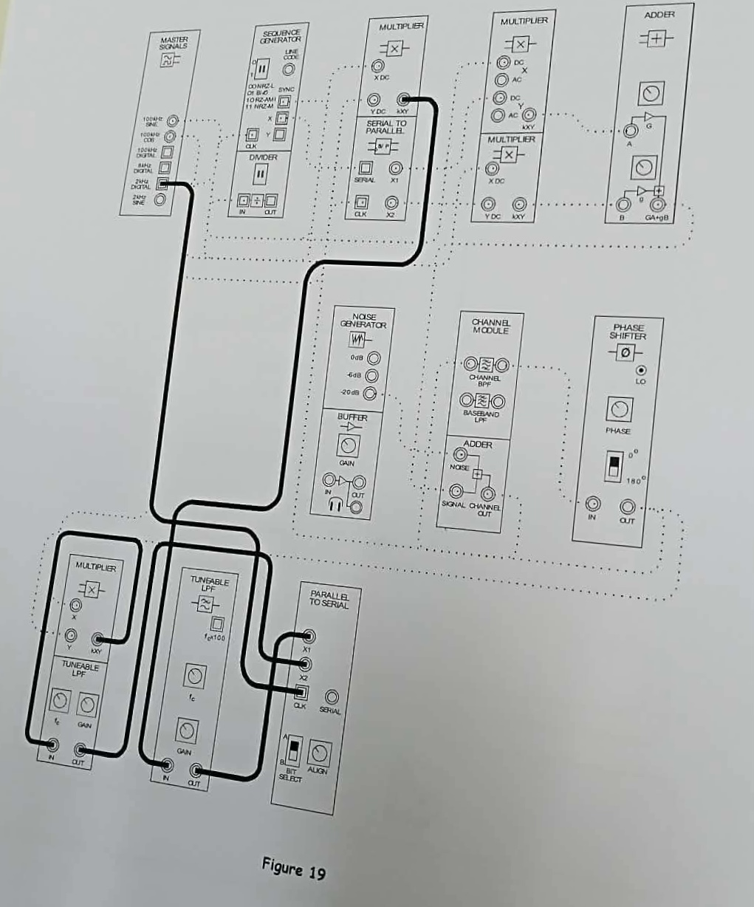

*Figure 4.1.1: Full Demodulation of the QPSK Signal Setup.*

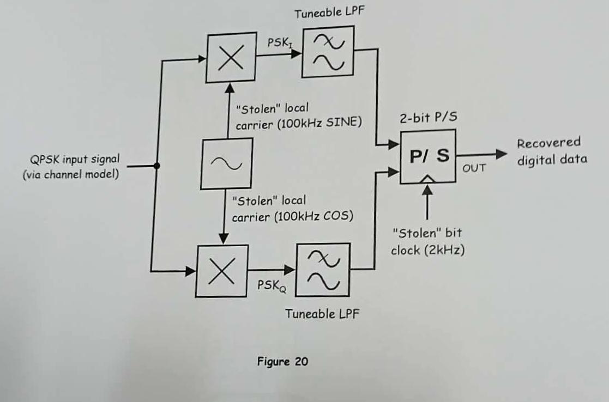

*Figure 4.1.1: Full Demodulation of the QPSK Signal Diagram.*

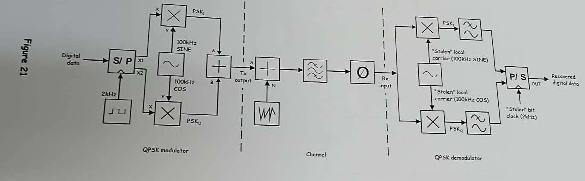

*Figure 4.1.1: Full Demodulation of the QPSK Signal Setup.*

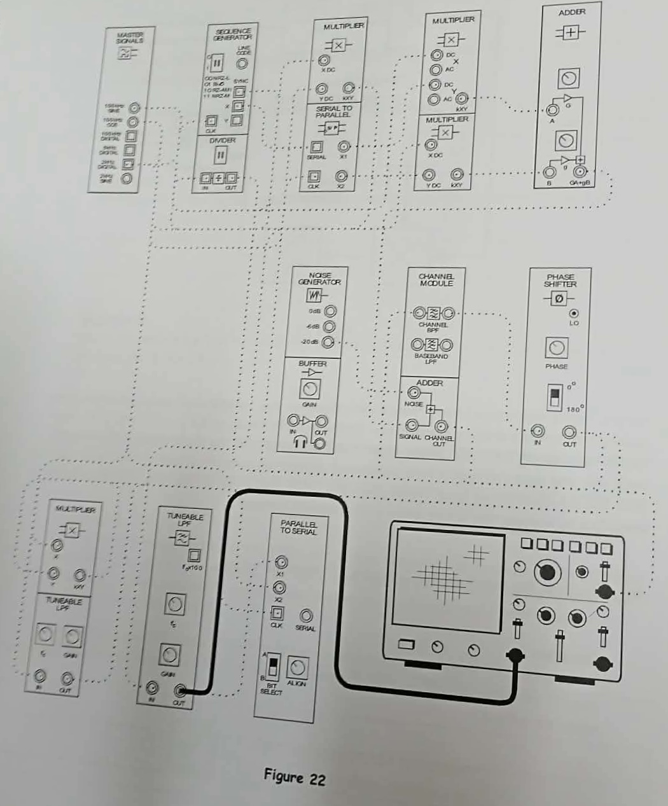

*Figure 4.1.1: Full Demodulation of the QPSK Signal Setup.*

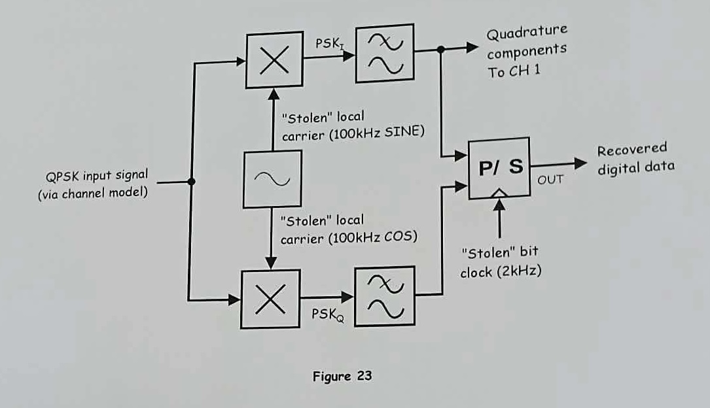

*Figure 4.1.1: Full Demodulation of the QPSK Signal Diagram.*

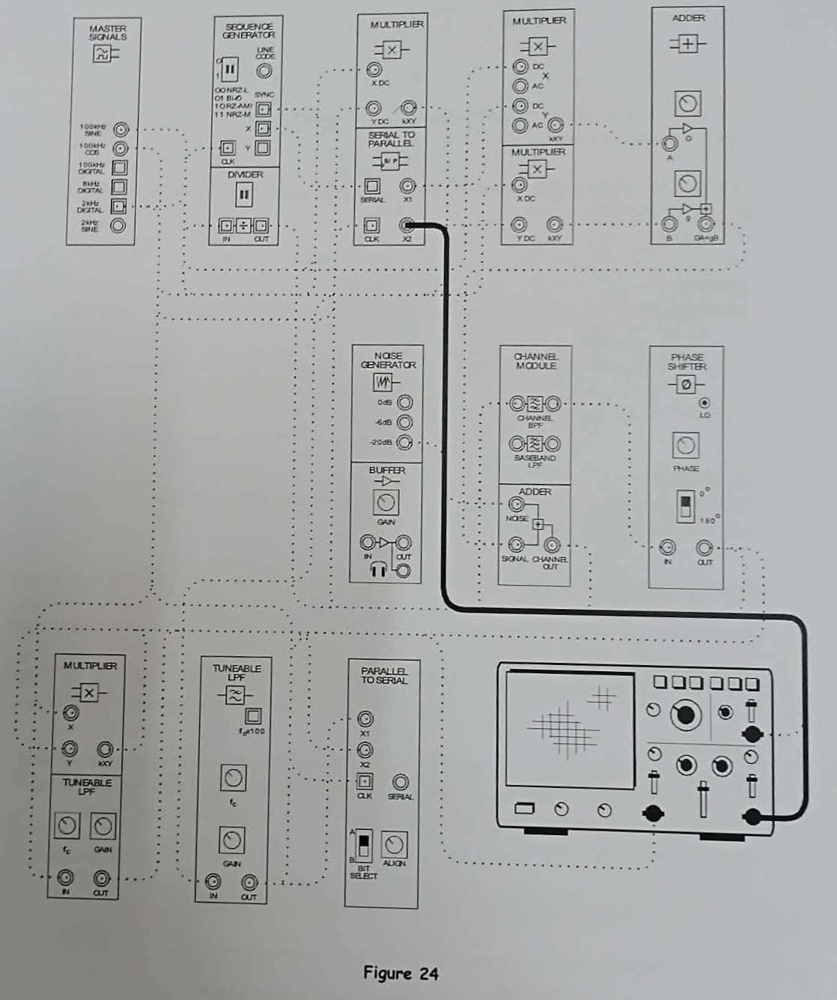

*Figure 4.1.1: Full Demodulation of the QPSK Signal Setup.*

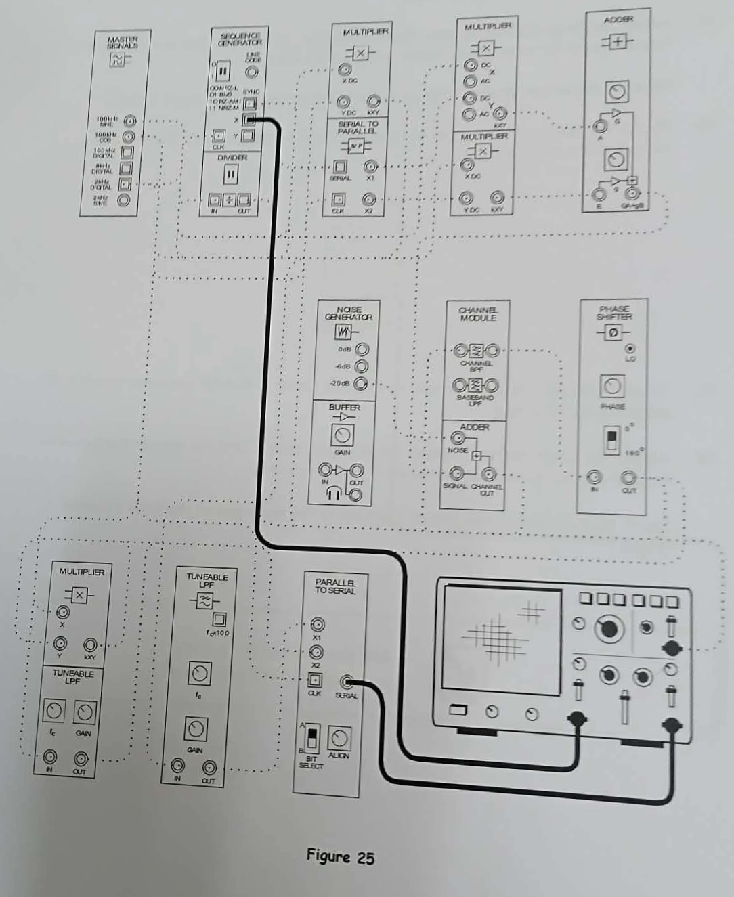

*Figure 4.1.1: Full Demodulation of the QPSK Signal Setup.*

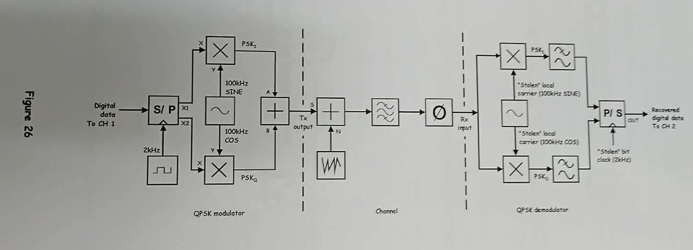

*Figure 4.1.1: Full Demodulation of the QPSK Signal Diagram.*

#### **4.2 Full Demodulation of the QPSK Signal Experimental Results**

View Part 4.2 Documentation

*Figure 4.2.1: Full Demodulation of the QPSK Signal*

## Part E: Observation of Noise on Recovered Digital Data
This section evaluates the robustness of QPSK against interference using Additive White Gaussian Noise (AWGN).
- Noise Injection: Using the Noise Generator and the Adder module, noise was added to the modulated signal before it reached the receiver.
- Constellation Mapping: In XY Mode, the four clean dots of the constellation began to expand into "noise clouds."
- Threshold Analysis: As the noise power increased, the "clouds" eventually overlapped. This visual representation confirms the Bit Error Rate (BER) increase: when the noise is high enough to push a signal from one quadrant into another, the receiver makes an incorrect bit decision.

#### **5.1 Observation of Noise on Recovered Digital Data Experimental Diagrams**

View Part 5.1 Diagrams

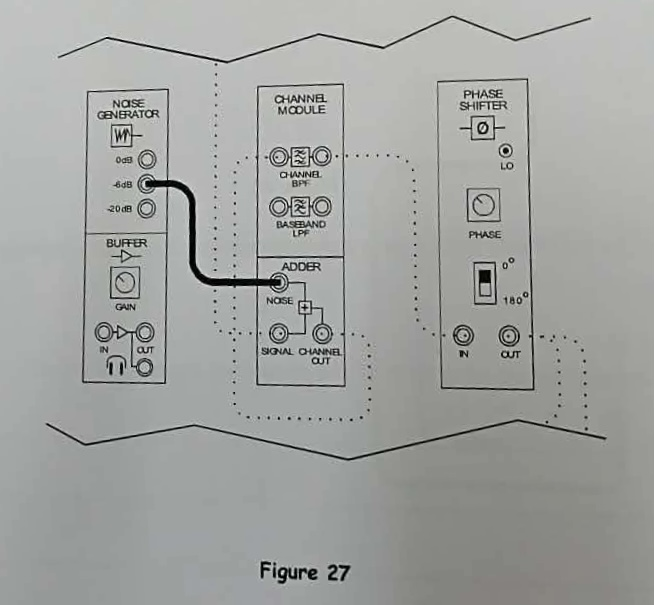

*Figure 5.1.1: Observation of Noise on Recovered Digital Data Setup.*

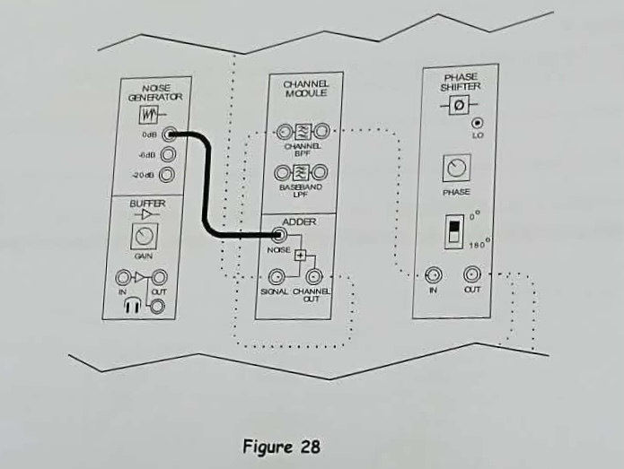

*Figure 5.1.1: Observation of Noise on Recovered Digital Data Setup.*

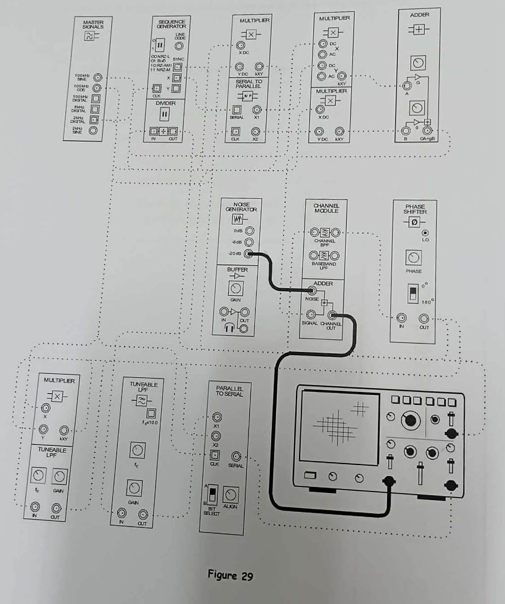

*Figure 5.1.1: Observation of Noise on Recovered Digital Data Setup.*

#### **5.2 Observation of Noise on Recovered Digital Data Experimental Results**

View Part 5.2 Documentation

*Figure 5.2.1: Observation of Noise on Recovered Digital Data Signal*

## Results & Data Analysis
**[View or Download Complete Experimental Question and Answers (PDF)](Data/Q&A-QPSK-Demodulation-Signal-Recovery-Analysis.pdf)**

## Project Resources
For full access to the raw datasets, formulas, and the complete Q&A worksheet, please use the links below:

* **[Download Complete Experimental Q&A (PDF)](Data/Q&A-QPSK-Demodulation-Signal-Recovery-Analysis.pdf)**
* **[Browse All Captured Documentation](Waveform_Captures/)**
